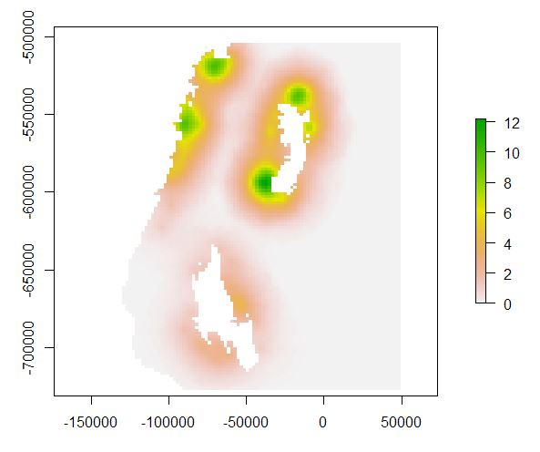

# wandeR
## About the package
The wandeR package is an R package for spatial modelling, particularly in the context of connectivity or dispersal activities (e.g. the movement of animals or people).

## Installation
``` r
devtools::install_github("EdSacre/wandeR")
```

## Getting Started


## Usage

