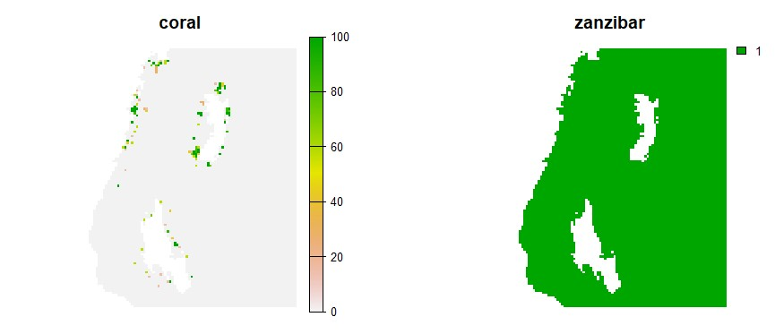
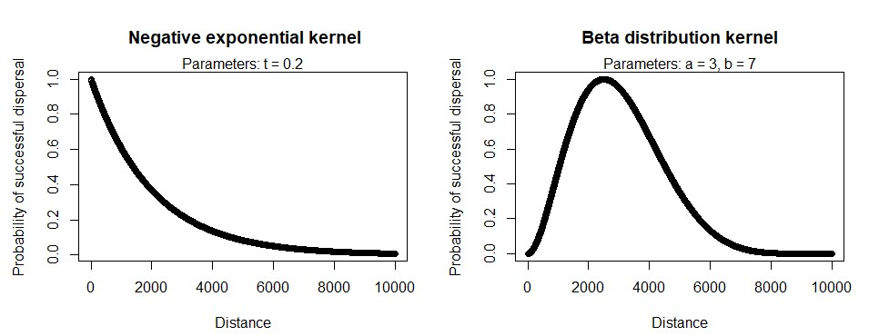
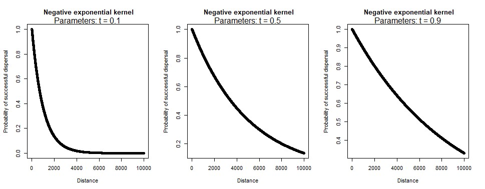
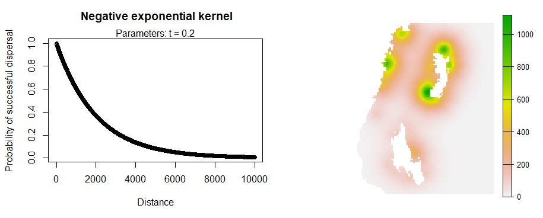
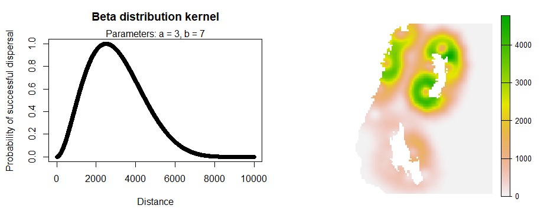
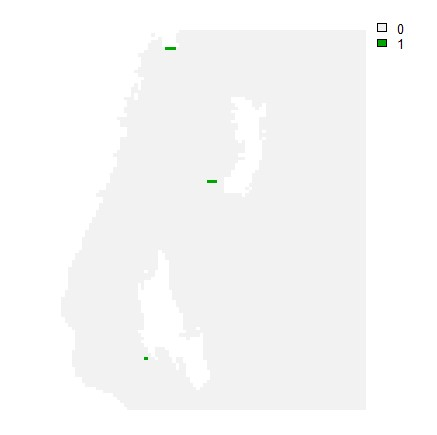
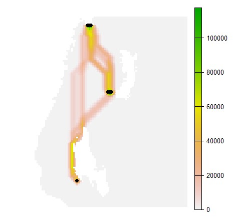

# wandeR
WARNING: This package is under development so you may encounter bugs/errors if attempting to use at this stage.

## Citation
Sacre, E. (2023) wandeR: Spatial tools for connectivity modeling (version 0.1.1). 
Available at: https://github.com/EdSacre/wandeR

## About the package
Provides functions for connectivity modelling and kernel density
mapping. The connectivity models are based on graph theory, and model the 
movement of species through space according to a dispersal kernel, least 
cost paths, and spatial barriers (e.g. land for marine species, or roads
for terrestrial species). Functions are provided for using a degree
centrality approach, but without the requirement of defining discrete
habitat patches. These functions can also include measures of habitat
suitability, quality, coverage, or any other intensity or abundance
type measure.These functions were designed for the modelling of species 
connectivity, but, of course, have many uses outside of ecology, such as in 
mapping the movements of people or diseases.

## Installation
``` r
install.packages("devtools") # If not already installed
devtools::install_github("EdSacre/wandeR")
```

## Getting Started
### Load packages
```{r}
library(wandeR)
library(terra)
```

### Import some testing dataset
The coral raster shows coral habitat around Zanzibar and Pemba Island.
The zanzibar raster show all ocean areas in the region.
We want to model the connectivity of corals in the area, assuming they can only
disperse through these ocean areas.
```{r}
coral <- wander_data("coral")
zanzibar <- wander_data("zanzibar")
terra::plot(c(coral, zanzibar), axes = FALSE)
```


### Examine dispersal kernel options
Here on the left we see a negative exponential distribution, which defines the dispersal kernel as decaying in
an exponential fashion. In other words, like likelihood of successful dispersal declines exponentially with distance between sites.
On the right is a beta distribution, which provides a slightly different definition for the dispersal kernel.
Instead, the probability of successful dispersal is low at short distances between sites, then rapidly increases for intermediate
distances, and then declines again.
```{r}
par(mfrow=c(1,2))
wander_kernel(kernel = "neg_exp")
wander_kernel(kernel = "beta")
```


Here we can see the effects that changes in the kernel parameters have on the shape of the kernel
```{r}
par(mfrow=c(1,3))
wander_kernel(kernel = "neg_exp", t = 0.1)
wander_kernel(kernel = "neg_exp", t = 0.5)
wander_kernel(kernel = "neg_exp", t = 0.9)
```


### Run the connectivity models
This model calculates the connectivity of each cell to the coral habitats. 
Cells with a high value are highly connected to many coral reef habitats,
and, therefore, likely serve as a "hub" or connectivity hotspot. Here we use the
default negative exponential dispersal kernel.
```{r}
conmod <- connect(habitats = coral, surface = zanzibar, maxdist = 50000, kernel = "neg_exp", nthreads = 1)
par(mfrow=c(1,2))
wander_kernel(kernel = "neg_exp")
terra::plot(conmod, axes = FALSE)
```


Now let's try running the connectivity model using the beta distribution. This 
is useful for modelling different kinds of movements. For example, let's imagine
that that coral pixels actually represent fishing boats. We might expect fishers
to avoid locations close to harbours, where there is high competition for 
resources. Instead, we might expect them to fish preferentially according to a
beta distribution.
```{r}
conmod <- connect(habitats = coral, surface = zanzibar, maxdist = 50000, kernel = "beta", nthreads = 1)
par(mfrow=c(1,2))
wander_kernel(kernel = "beta")
terra::plot(conmod, axes = FALSE)
```


### The highway/corridor connectivity model
Now we will run the "highway" connectivity model, which models highways or corridors 
through which species are predicted to most often travel. This model can take a
long time to calculate, so we will use a subset of the coral data with only a few
habitat cells.
```{r}
coral_subset <- wander_data("coral_subset")
terra::plot(coral_subset, axes = FALSE)
```


Now, let's run the highway model.
```{r}
highmod <- highway(habitats = coral_subset, surface = zanzibar, maxdist = 200000, nthreads = 1)
coral_subset[coral_subset == 0] <- NA
coral_point <- terra::as.points(coral_subset)
terra::plot(highmod, axes = FALSE)
terra::plot(coral_point, add = TRUE)
```


